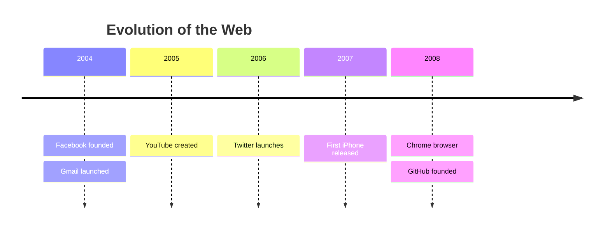

# My Informational Timeline

Here is a timeline of the early web, rendered automatically by GitHub.

```mermaid
timeline
    title Evolution of the Web
    2004 : Facebook founded
         : Gmail launched
    2005 : YouTube created
    2006 : Twitter launches
    2007 : First iPhone released
    2008 : Chrome browser
         : GitHub founded
```